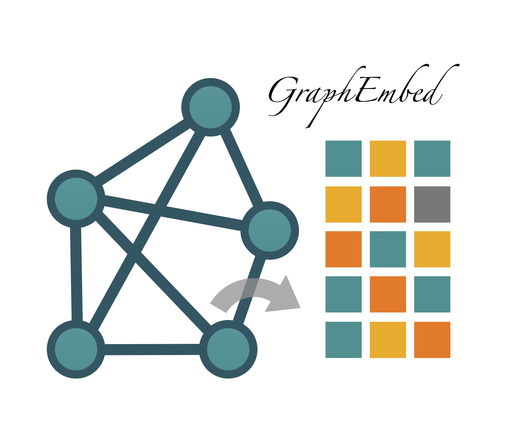

[](http://bioconda.github.io/recipes/graphembed/README.html)


[](https://anaconda.org/bioconda/graphembed)

<div align="center">
  
</div>

# GraphEmbed: Efficient and Robust Network Embedding via High-Order Proximity Preservation or Recursive Sketching

This crate provides an executable and a library for embedding of directed or undirected graphs with positively weighted edges. We engineered and optimized current network embedding algorithms for large-scale network embedding, especially biological network. This crate was developed by [Jianshu Zhao](https://gitlab.com/Jianshu_Zhao) and Jean-Pierre Both [jpboth](https://gitlab.com/jpboth). We have a copy here in [Github](https://github.com/jianshu93/graphembed)


  - For simple graphs, without data attached to nodes, there are 2 modules **nodesketch** and **atp**. A simple executable with a validation option based on link prediction is also provided.

## Quick Install

### Pre-built binaries on Linux
```bash
wget https://gitlab.com/-/project/64961144/uploads/9d7d0b038140cb67c584f01cd6dafac9/graphembed_Linux_x86-64_v0.1.6.zip
unzip graphembed_Linux_x86-64_v0.1.6.zip
chmod a+x ./graphembed
./graphembed -h
```

### Bioconda on Linux/MacOS
```bash
conda install -c conda-forge -c bioconda graphembed
```

### Homebrew on MacOS
```bash
brew tap jianshu93/graphembed
brew update
brew install graphembed
```


### In Python (Please install python>=3.9 first)
```bash
pip install graphembed_rs

### or you can build from source (Linux) after installing maturin
git clone https://gitlab.com/Jianshu_Zhao/graphembed
cd graphembed
pip install maturin
### note: for macOS, you need to change the line "features = ["pyo3/extension-module", "intel-mkl-static", "simdeez_f"]" in pyporject.toml to "features = ["pyo3/extension-module","openblas-system","stdsimd"]", you also need to Install OpenBLAS and add to system library path via Homebrew
maturin develop --release

#### Prepare some data
wget https://gitlab.com/-/project/64961144/uploads/4e341383d62d86d1dd66e668e91b2c07/BlogCatalog.txt
```

```python
import os
os.environ["RUST_LOG"] = "info"
import graphembed_rs.graphembed_rs as ge
import graphembed_rs.load_utils as ge_utils
help(ge)
help(ge_utils)
### HOPE
ge.embed_hope_rank("BlogCatalog.txt", target_rank=128, nbiter=4,output="embedding_output")
out_vectors=ge_utils.load_embedding_bson("embedding_output.bson")
print("OUT embedding shape :", out_vectors.shape)
print("first OUT vector    :", out_vectors[0])

### Sketching
### sketching only
ge.embed_sketching("BlogCatalog.txt", decay=0.3, dim=128, nbiter=5, symetric=True, output="embedding_output")
out_vectors=ge_utils.load_embedding_bson("embedding_output.bson")
print("OUT embedding shape :", out_vectors.shape)
print("first OUT vector    :", out_vectors[0])


### validate accuracy
auc_scores = ge.validate_sketching("BlogCatalog.txt",decay=0.3, dim=128, nbiter=3, nbpass=1, skip_frac=0.2,symetric=True, centric=True)
print("Standard AUC per pass:", auc_scores)
```

## Methods
### The embedding algorithms used in this crate are based on the following papers

- **nodesketch**

*NodeSketch : Highly-Efficient Graph Embeddings via Recursive Sketching KDD 2019*.  see [nodesketch](https://dl.acm.org/doi/10.1145/3292500.3330951)  
    D. Yang,P. Rosso,Bin-Li, P. Cudre-Mauroux.

It is based on multi hop neighbourhood identification via sensitive hashing based on the recent algorithm **probminhash**. See [arxiv](https://arxiv.org/abs/1911.00675) or  [ieee-2022](https://ieeexplore.ieee.org/document/9185081).

The algorithm associates a probability distribution on neighbours of each point depending on edge weights and distance to the point.
Then this distribution is hashed to build a (discrete) embedding vector consisting in nodes identifiers.  
The distance between embedded vectors is the Jaccard distance so we get
a real distance on the embedding space for the symetric embedding.  

An extension of the paper is also implemented to get asymetric embedding for directed graph. The similarity is also based on the hash of sets (nodes going to or from) a given node but then the dissimilarity is no more a distance (no symetry and some discrepancy with the triangular inequality).

**The orkut graph with 3 millions nodes and 100 millions of edge is embedded in 5' with a 24 core i9 laptop with this algorithm giving an AUC of 0.95**.


- **atp**

*Asymetric Transitivity Preserving Graph Embedding 2016*.
    M. Ou, P Cui, J. Pei, Z. Zhang and W. Zhu. See [hope](https://dl.acm.org/doi/10.1145/2939672.2939751).

The objective is to provide an asymetric graph embedding and get estimate of the precision of the embedding in function of its dimension.  

We use the Adamic-Adar matricial representation of the graph. (It must be noted that the ponderation of a node by the number of couples joined by it is called Resource Allocation in the Graph Kernel litterature).
The asymetric embedding is obtained from the left and right singular eigenvectors of the Adamic-Adar representation of the graph.
Source node are related to left singular vectors and target nodes to the right ones.  
The similarity measure is the dot product, so it is not a norm.  
The svd is approximated by randomization as described in Halko-Tropp 2011 as implemented in the [annembed crate](https://crates.io/crates/annembed).

## Validation

Validation of embeddings is assessed via standard Auc with random deletion of edges. See documentation in the *link* module and *embed* binary.
We give also a variation based on centric quality assessment as explained at [cauc](http://github.com/jean-pierreBoth/linkauc)
## Some data sets

Small datasets are given in the Data subdirectory (with 7z compression) to run tests.  
Larger datasets can be downloaded from the SNAP data collections <https://snap.stanford.edu/data>

#### Some small test graphs are provided in a Data subdirectory

- Symetric graphs

  - Les miserables  <http://konect.cc/networks/moreno_lesmis>.  
    This is the graph of co-occurence of characters in Victor Hugo's novel 'Les Misérables'.

- Asymetric graphs

  - wiki-vote <https://snap.stanford.edu/data/wiki-Vote.html>
         7115 nodes 103689 edges

  - Cora : <http://konect.cc/networks/subelj_cora>
        citation network 23166 nodes 91500 edges

#### Some larger data tests for user to download

These graphs were used in results see below.

Beware of the possible need to convert from Windows to Linux End Of Line, see the dos2unix utility.  
Possibly some data can need to be converted from Tsv format to Csv, before being read by the program.

- Symetric

  - Amazon.   Nodes: 334 863   Edges: 925 872  <https://snap.stanford.edu/data/amazon0601.html>
  - youtube.  Nodes: 1 134 890 Edges: 2 987 624 <https://snap.stanford.edu/data/com-Youtube.html>
  - orkut.    Nodes: 3 072 441 Edges: 117 185 083 <https://snap.stanford.edu/data/com-Orkut.html>

- Asymetric

  - twitter as tested in Hope  <http://konect.cc/networks/munmun_twitter_social>
        465017 nodes 834797 edges

## Some results

### results for the *atp* and *nodesketch* modules

Embedding and link prediction evaluation for the above data sets are given in file [resultats.md](./resultats.md)
A more global analysis of the embedding with the nodesketch module is done for the orkut graph in file [orkut.md](./orkut.md)

A preliminary of node centric quality estimation is provided in the validation module (see documentation in validation::link).  

### Some qualitative comments

- For the embedding using the randomized svd, increasing the embedding dimension is interesting as far as the corresponding eigenvalues continue to decrease significantly.

- The munmun_twitter_social graph shows that treating a directed graph as an undirected graph give significantly different results in terms of link prediction AUC.


## Generalized Svd

An implementation of Generalized Svd comes as a by-product in module [gsvd](./src/atp/gsvd.rs).

## Detailed Installation and Usage

### Installation

The crate provides features (with a default configuration), required by the *annembed* dependency, to specify which version of lapack you want to use or the choice of simd implementation.
- For example compilation is done by :
*cargo build --release --features="openblas-system"* to  use a dynamic link with openblas.
The choice of one feature is mandatory to provide required linear algebra library.  
- On Intel the simdeez_f feature can be used. On other cpus the stdsimd feature can be chosen but it requires compiler >= 1.79

### Usage

The embed module can be generated with the standard : cargo doc --no-deps --bin embed.  

- The Hope embedding relying on matrices computations limits the size of the graph to some hundred thousands nodes.
It is intrinsically asymetric in nature. It nevertheless gives access to the spectrum of Adamic Adar matrix representing the graph and
so to the required dimension to get a valid embedding in $R^{n}$.  

- The Sketching embedding is much faster for large graphs but embeds in a space consisting in sequences of node id equipped with the Jaccard distance. It is particularly efficient in low degrees graph.

- The *embed* module takes embedding and possibly validation commands (link prediction task) in one directive.  
The general syntax is :

    graphembed file_description [validation_command --validation_arguments] sketching mode  --embedding_arguments  
    for example:  

  For a symetric graph we get:

- just embedding:
        graphembed --csv ./Data/Graphs/Orkut/com-orkut.ungraph.txt --symetric  sketching --decay 0.2  --dim 200 --nbiter 

- embedding and validation:
 
        graphembed --csv ./Data/Graphs/Orkut/com-orkut.ungraph.txt  --symetric  validation --nbpass 5 --skip 0.15 sketching --decay 0.2  --dim 200 --nbiter 5

For an asymetric graph we get 

       graphembed --csv ./Data/Graphs/asymetric.csv  validation --nbpass 5 --skip 0.15 sketching --decay 0.2  --dim 200 --nbiter 5 


    More details can be found in docs of the embed module. Use cargo doc --no-dep --bin embed (and cargo doc --no-dep) as usual.

- Use the environment variable RUST_LOG gives access to some information at various level (debug, info, error)  via the **log** and **env_logger** crates.

## License

Licensed under either of

* Apache License, Version 2.0, [LICENSE-APACHE](LICENSE-APACHE) or <http://www.apache.org/licenses/LICENSE-2.0>
* MIT license [LICENSE-MIT](LICENSE-MIT) or <http://opensource.org/licenses/MIT>

at your option.
